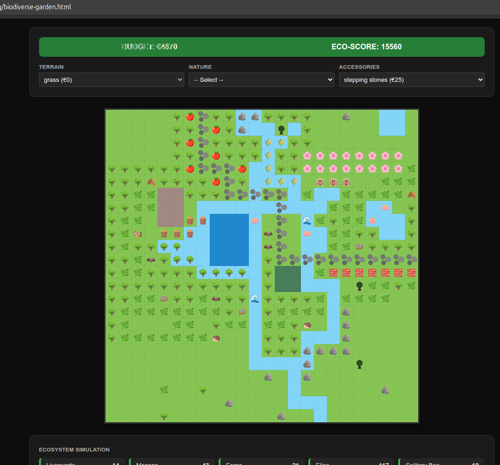

# Garden Architect - Planning Mode

**An educational single-file HTML + JavaScript biodiversity planning game**

Download the HTML and click on it to run it in your favorite browser. It is a self-contained file.

Preview, screenshot:

Build your own rich ecosystem on a 24×24 grid. Plan habitats, place trees, water features, hedges and accessories, then watch a realistic food-web simulation calculate populations of over 35 species.

Perfect for learning ecology, food chains, connectivity, and habitat requirements — all in one self-contained HTML file (no server, no install).

NOTES:
 
1. this is not realistic but has some logic to it, the goal is to teach the big topics about eco-systems and landscapes
2. this was created by myself in multiple iterations with historically Gemini and also Grok AI (LLM)
3. this is just a small hobby project, so do not take this too seriously
4. you can adapt it how you like

## Features

- **Interactive grid** — paint with mouse or touch
- **Realistic ecosystem simulation**:
  - Habitats, food chains, virtual metrics (forest connectivity, wetland fragmentation, tree-in-water, etc.)
  - Mosquito predation hierarchy (Fish > Bats > Birds > ...)
- **Strict placement rules** (educational realism):
  - Stepping stones only on grass/dirt/sand/shallow-water
- **Grass = smart undo** — left-click grass to fully clear a cell and get full refund
- **Achievements & Milestones** with medals (including "Connected Forest!", "Biodiversity Master", etc.)
- **Budget planning mode** — every placement costs money, removals refund
- **Mobile friendly** — scrollable grid + long-press removal (not perfect on mobile...)

## How to Play

1. Open `bio-diverse-garden.html` in any browser (no installation needed)
2. Choose terrain, nature or accessory from the dropdowns
3. Left-click to place, right-click (or long-press on mobile) to remove top layer
4. Use **Grass** to completely reset a cell (full refund)
5. Watch the ecosystem simulation and achievements updates (list below)
6. Goal: Create a thriving, connected biodiversity garden within budget

## Educational Value

- Shows **habitat requirements** and **food-web dependencies**
- Demonstrates importance of **nature corridors** (largest connected forest component)
- Teaches **wetland connectivity vs fragmentation** trade-offs
- Visualises predator-prey relationships and mosquito control
- Encourages thoughtful planning instead of random placement

## Technical Details

- Pure vanilla HTML5 + CSS + JavaScript (single file, ~250 KB)
- Flood-fill algorithms for connectivity metrics
- Topological dependency resolution for species populations
- No external dependencies or internet required

## Files

- `bio-diverse-garden.html` — the complete game

Just download the HTML and open in your favorite browser.
You can edit the HTML file and use an infinite budget or customise as you wish!

---

**Made as an educational tool for understanding real-world ecology through play.**

Enjoy building your perfect garden ecosystem, you can download the HTML, just click on it to run.

